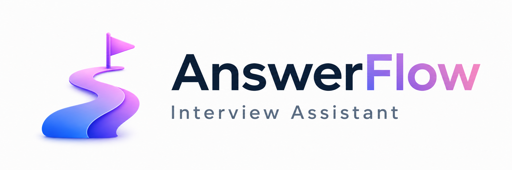

<p align="center">
  
</p>

# AnswerFlow

**Open-source desktop interview assistant for prep, live transcription, real-time answer support, and post-interview follow-up.**

[](LICENSE)
[](https://github.com/FarzamHejaziK/AnswerFlow/releases)
[](https://github.com/FarzamHejaziK/AnswerFlow/releases/latest)
[](https://github.com/FarzamHejaziK/AnswerFlow/releases)
[](https://github.com/FarzamHejaziK/AnswerFlow/actions/workflows/build-windows.yml)
[](https://github.com/FarzamHejaziK/AnswerFlow/actions/workflows/release-macos.yml)

[Download Latest Release](https://github.com/FarzamHejaziK/AnswerFlow/releases/latest) ·
[Report an Issue](https://github.com/FarzamHejaziK/AnswerFlow/issues) ·
[View Source](https://github.com/FarzamHejaziK/AnswerFlow)

Requires macOS 12+ on Apple Silicon or Intel, or Windows 10/11 on Intel/AMD 64-bit.

AnswerFlow is a desktop interview assistant for preparing context, transcribing live interviews, and continuing the conversation afterward with the full interview history available as context.

It is designed around one flow:

1. Configure your AI provider, audio devices, and permissions.
2. Create a new interview.
3. Build context in the prep chat and attach reusable documents.
4. Start the live interview when your meeting app is ready.
5. Review transcript, AI answers, and follow-up chat after the interview ends.

## Download

Installers are published from GitHub Releases.

| Platform | Download | Notes |
| --- | --- | --- |
| Windows 10/11 x64 | [Latest release assets](https://github.com/FarzamHejaziK/AnswerFlow/releases/latest) | NSIS installer. Current builds are configured for Azure Artifact Signing with the `answerflow-windows` public-trust certificate profile. |
| macOS Apple Silicon | [Latest release assets](https://github.com/FarzamHejaziK/AnswerFlow/releases/latest) | Use the Apple Silicon ZIP/DMG artifact when available. |
| macOS Intel | [Latest release assets](https://github.com/FarzamHejaziK/AnswerFlow/releases/latest) | Use the Intel DMG/ZIP artifact when available. |

If your operating system warns about an unsigned or newly signed build, make sure you downloaded it from the official AnswerFlow release page.

## Why AnswerFlow?

- **Interview-first flow:** prep chat, reusable docs, live interview transcript, AI answers, and post-interview follow-up all stay in one interview timeline.
- **Bring your own provider key:** OpenAI, Google Gemini, and Anthropic Claude are supported from Settings.
- **Local transcription path:** Moonshine Base runs locally after setup, so live transcription does not need a cloud speech provider.
- **Reusable document context:** Markdown, TXT, PDF, and DOCX files are ingested into Markdown locally and can be attached across interviews.
- **Persistent interview memory:** prep chat, selected docs, transcript, AI responses, and post-interview chat are saved so you can reopen an interview later.
- **Light and dark UI:** the desktop app follows the AnswerFlow visual system with both themes available.

## Current Product Shape

AnswerFlow is focused on interview workflows, not a generic meeting dashboard.

- **Preflight setup:** first-run setup guides the user through provider keys and required permissions.
- **Provider keys:** Settings supports the main LLM providers: OpenAI, Google Gemini, and Anthropic Claude.
- **Local transcription:** speech transcription uses the local Moonshine Base model downloaded during setup. Users should not need to choose a speech provider.
- **Prep chat:** before an interview starts, the user can chat with the assistant to build interview context.
- **Document context:** users can upload Markdown, TXT, PDF, and DOCX files. Files are ingested locally into Markdown, saved for reuse, and can be attached per interview.
- **Custom instructions:** Settings includes Custom Instructions and AI Persona. Custom Instructions can also ingest one local file.
- **Live interview phase:** the live transcript separates interviewer speech, user speech, and AI responses.
- **Post-interview chat:** after the interview finishes, the user can keep asking questions with prep chat, selected docs, transcript, and generated AI responses available as context.
- **Help assistant:** a bottom help entry opens a persistent help chat backed by the in-app AnswerFlow Help Guide and the user's selected main LLM.
- **Light and dark UI:** the UI uses the current AnswerFlow palette and supports theme switching.

## Repository

Main repository:

```bash
https://github.com/FarzamHejaziK/AnswerFlow
```

Clone:

```bash
git clone https://github.com/FarzamHejaziK/AnswerFlow.git
cd AnswerFlow
```

The original upstream project remains configured separately for future merge updates, but AnswerFlow branding, documentation, and release metadata should point to this repository.

## License

This fork remains under the original AGPL-3.0 license. If you publish modified versions, keep the license notices and make corresponding source available as required by AGPL-3.0.

## Local Development

Recommended stack:

- Node.js 20+ or 22 LTS
- npm
- Rust and Cargo for the native audio module
- Xcode Command Line Tools on macOS

Install dependencies:

```bash
npm install
```

Build the native audio module:

```bash
npm run build:native
```

Run locally:

```bash
npm start
```

This starts Vite on `http://localhost:5180` and launches Electron.

Fast checks:

```bash
npm run build:electron
npx tsc --noEmit
```

Run the full service test suite only when needed:

```bash
npm test
```

## Manual Testing

For a clean local smoke test:

1. Start the app with `npm start`.
2. Open Settings.
3. Add one provider key: OpenAI, Google Gemini, or Anthropic Claude.
4. Select the model in the right panel.
5. Confirm microphone input and meeting/system audio output.
6. Grant required operating-system permissions.
7. Create a New Interview.
8. Add prep context in the chat.
9. Attach a sample document and confirm it appears in the message history.
10. Start the interview.
11. Confirm live transcript separates interviewer, user, and AI response messages.
12. End the interview.
13. Confirm the "Interview finished" boundary appears after the last transcript item.
14. Ask a follow-up question in the post-interview chat.
15. Reopen the interview and confirm prep chat, selected docs, transcript, and post-interview chat persist.

## Audio Setup

For live interview transcription, AnswerFlow needs:

- Microphone input for your voice.
- Meeting/system audio output for the interviewer.

The output device selected in AnswerFlow should match the device used by Zoom, Teams, Google Meet, or the meeting app. If the meeting plays through AirPods, choose AirPods. If it plays through Studio Display Speakers, choose Studio Display Speakers.

If only your voice transcribes, the meeting/system audio device is probably mismatched or missing permission. If only the interviewer transcribes, check microphone input and microphone permission.

## Document Ingestion

Supported prep and custom-instruction files:

- `.md`
- `.txt`
- `.pdf`
- `.docx`

Files are converted to Markdown locally and saved in the app's document library. After a document is uploaded once, selecting it for a later interview should attach the existing ingested document directly without asking again for its type.

When a newly uploaded document is classified, the user can choose:

- Resume
- Project
- Other

For `Other`, the user should add a short description so the assistant understands how to use it.

## Prompt Context Model

The live interview assistant should receive context in this order:

```text
<custom_instructions>
Typed custom instructions and ingested custom-instruction file Markdown.
</custom_instructions>

<ai_persona>
The user's preferred assistant behavior and voice.
</ai_persona>

<interview_preparation_context>
Prep chat notes plus selected document Markdown for this interview.
</interview_preparation_context>

<live_interview_transcript>
Current transcript and generated AI responses from the live interview.
</live_interview_transcript>

<user_request>
The current live answer request or follow-up chat question.
</user_request>
```

The prep context must be included in live interview answer generation, not only in the pre-interview chat.

## Git Workflow

This checkout tracks:

- `origin`: `https://github.com/FarzamHejaziK/AnswerFlow.git`
- `upstream`: `https://github.com/FarzamHejaziK/AnswerFlow.git`

Push AnswerFlow work to `origin`, not `upstream`.

To pull future upstream updates:

```bash
git fetch upstream
git checkout main
git merge upstream/main
git push origin main
```

Prefer merge over rebase on shared/public branches so public history is not rewritten.
